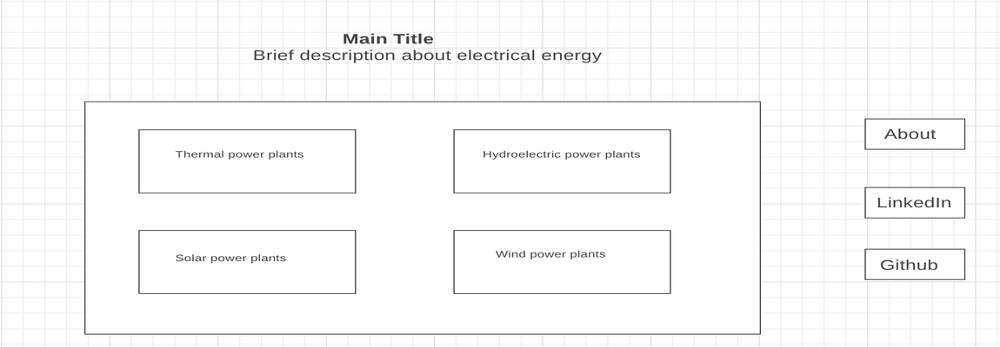
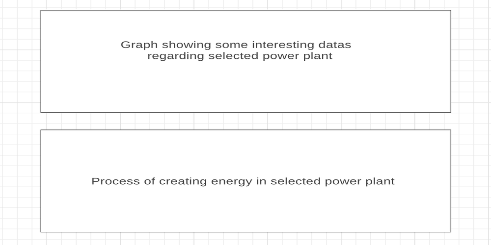

# Power Up

## Background

Power Up is a mixture of data visualization and a demo. It contains a visual demonstration of how the electricity is being made and how the electricity travels from the source all the way to our homes. It will also contain data visualization of the selected power plant. 

## Functionality & MVP

With Power up simulation, users will be able to: 

* Choose a picture that represents a type of a power plant 

* Once the user selects a type of power plant a user will be able to see the simulation of how the electricity travel from the source to the clients.

* Users will be able to read important data about selected information from the chart such as, how many of such power plants are being used in the world, their impact on the environment etc.

* Users will be able to close selected power plant a go back to the home page.

In  addition, this project will include:

* An about modal describing the role of electrical energy in our lifes.

* A production README 

## Wireframes 

This app will consist of 4 images that represent types of power plants. It will have, Hydroelectric power plants, Thermal power plants, Solar power plants, and Wind power plants. Ad well as nav links to the Github, my LinkedIn, and the About modal. Clicking on one of the images will lead to a simulation of how the electricity is being produced in the selected power plant as well as a graph with information about how many of those power plants we have in the world, in New York specifically, what are the costs of building and average  power plant of that kind and its effects to the environment. 

## Implementation Timeline

* Day 1: Setting up all necessary Node modules that I will need. Setting up the home page, making all the images clickable. Determining the style I want my app to have.

* Day 2: Working on a simulation of how selected power plant functions.

* Day 3: Implementing a graph that contains  interesting information about selected power plant 

## Architecture and Technologies 

* JavaScript 
* HTML5 
* CSS5 
* D3

